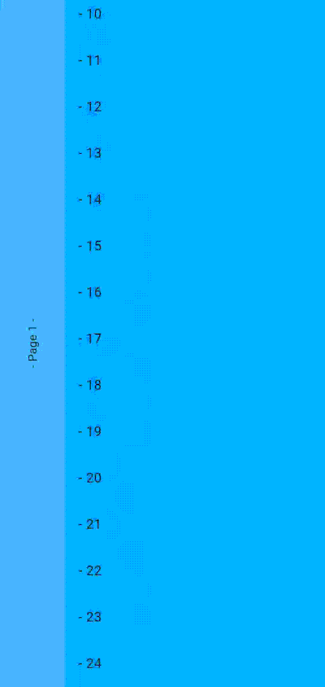
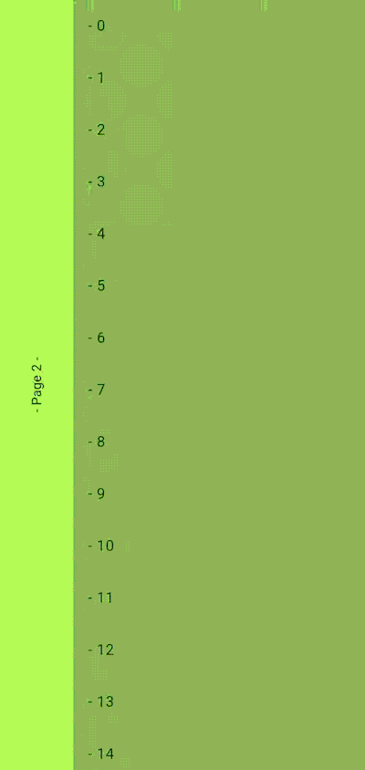
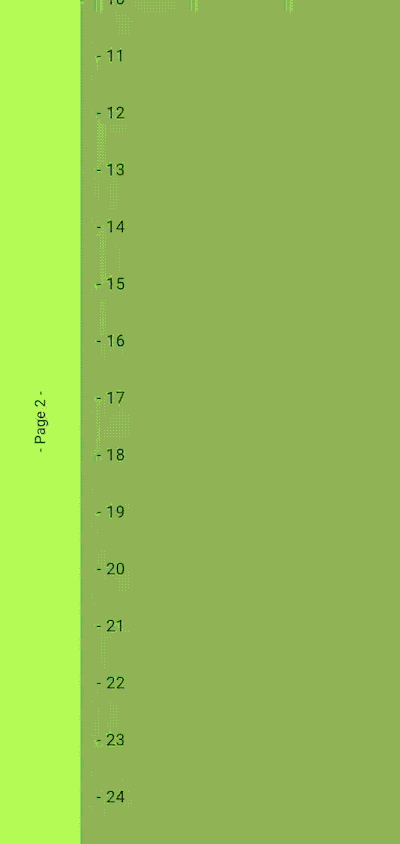
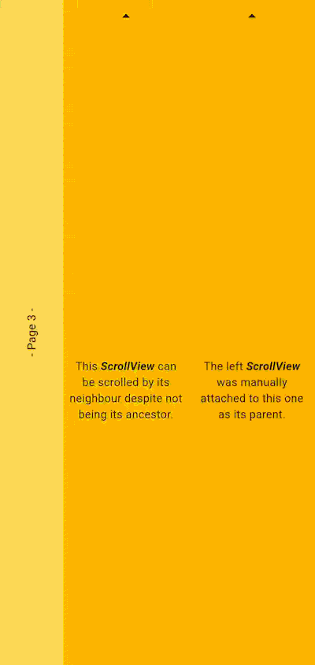

# Nested Scrollables for Flutter

Seamless scrolling between nested Scrollable widgets.

## Features

Use a `ScrollableNester` widget to wrap your scrollables, to automatically
link their associated controllers, child to parent, or build your own chain of
controllers manually.

## Behavior

Try out the [live demo](https://barthbv.github.io/nested_scrollables/) or run the example project.

<table>
    <tr>
        <td width="50%" valign="top">
            
            When scrolling a view, reaching the edge of the scrollable will try to scroll the first parent of that scrollable.
        </td>
        <td width="50%" valign="top">
            
            When a scrollable receives a fling gesture, it will fling towards its edge but never scroll a parent as a result.
        </td>
    </tr>
    <tr>
        <td width="50%" valign="top">
            
            However if a scrollable is already deferring its scroll to a parent, and receives a fling gesture, the parent will receive the fling instead.
        </td>
        <td width="50%" valign="top">
            
            If a scrollable is deferring its scroll to a parent, but is then being scrolled back the other way, the parent can still steal the scroll event instead.
        </td>
    </tr>
</table>

A `NestedPageController` will always take priority to return to a flully displayed page before allowing a child scrollable to scroll again, and a `NestedScrollController` can optionally replicate this behavior.

## Usage

The package provides some controllers and widgets :
- the `NestedScrollController`, used in place of a `ScrollController`
- the `NestedPageController`, used in place of a `PageController`

- the `ScrollableNester` widget, which creates the relevant controller if none is provided manually

And also mixins to implement custom controllers if needed :
- the `NestedScrollableController` mixin, and its associated
- `NestedScrollablePosition` mixin, used by the position created by the controller


### With the ScrollableNester widget

```dart
final Widget Function(BuildContext context, int index) _itemBuilder;
final Widget _child;
final pageController = NestedPageController();

// The `controller` parameter is optional in both the
// named constructors, and one will be created internally if
// left null.
ScrollableNester.pageView(
    controller: nestedPageController,
    builder: (context, controller) {
        // Use the controller in the scrollable widget
        return PageView(
            controller: controller,
            children: [
                // Both the following scrollables control the
                // parent PageView when they reach the end of
                // their extent
                ScrollableNester.scrollView(
                    builder: (context, controller) {
                        return ListView.builder(
                            controller: controller,
                            itembuilder: _itemBuilder,
                        );
                    },
                ),
                // The unnamed constructor requires a controller
                // to be provided
                ScrollableNester(
                    controller: NestedScrollController(),
                    builder: (context, controller) {
                        return SingleChildScrollView(
                            controller: controller,
                            child: _child,
                        );
                    },
                );
            ],
        )
    }
);
```

The `ScrollableNester` widget will search for a parent nested scrollable and attach it to its controller automatically.
If the controller is set as a "root", the chain ends with that controller.

To force a controller as root, set its `primary` parameter to `true` :
```dart
ScrollableNester.pageView(
    primary: true,
    builder: ...
);
```
or
```dart
final controller = NestedScrollController(
    primary: true,
);
```

Set the parameter `keepNestedScrollOrigin` when creating a `NestedScrollController` to have its position record the origin point of a nested scroll event.

### Manual controller linking

You can manually attach a `NestedScrollableController` to another one, wherever their associated `Scrollable` widget might sit in the tree.

```dart
final parentController = NestedPageController();
final childController = NestedScrollController();

childController.attachParent(parentController);
```

The controller that is attached to another is considered the parent controller, and will be scrolled by the child when the child attempts to scroll past one of its edges.
The link can be reset by calling `childController.attachParent(null)` or changed at will.

**NOTE :** scroll nesting searches for parents that scroll along the same `Axis`.
When a scrollable attempts to defer its movement up the chain, any parent controller using a position that doesn't share its axis will be skipped and will pass along its own parent to the child, until a suitable candidate is found or the end of the chain is reached.

### _Disclaimer_

_This package contains duplicated code from the Flutter SDK, by necessity : the nesting feature is added as transparently as possible on top of the existing scrolling implementation, specifically to the `ScrollPosition` created by a `ScrollController`.
The `PageController` uses a private `_PagePosition` internally, and most of the page scrolling behavior sits in private members and methods, so unlike the `NestedScrollPositionWithSingleContext` used by the `NestedScrollController`, which basically just extends `ScrollPositionWithSingleContext` and mixes in `NestedScrollablePosition`, the `NestedPagePosition` extends a duplicated `_PagePosition` class, and by extension the `NestedPageController` a duplicated `PageController` (which still implements `PageController`).
None of that duplicated code is altered, and is marked as such in the files._